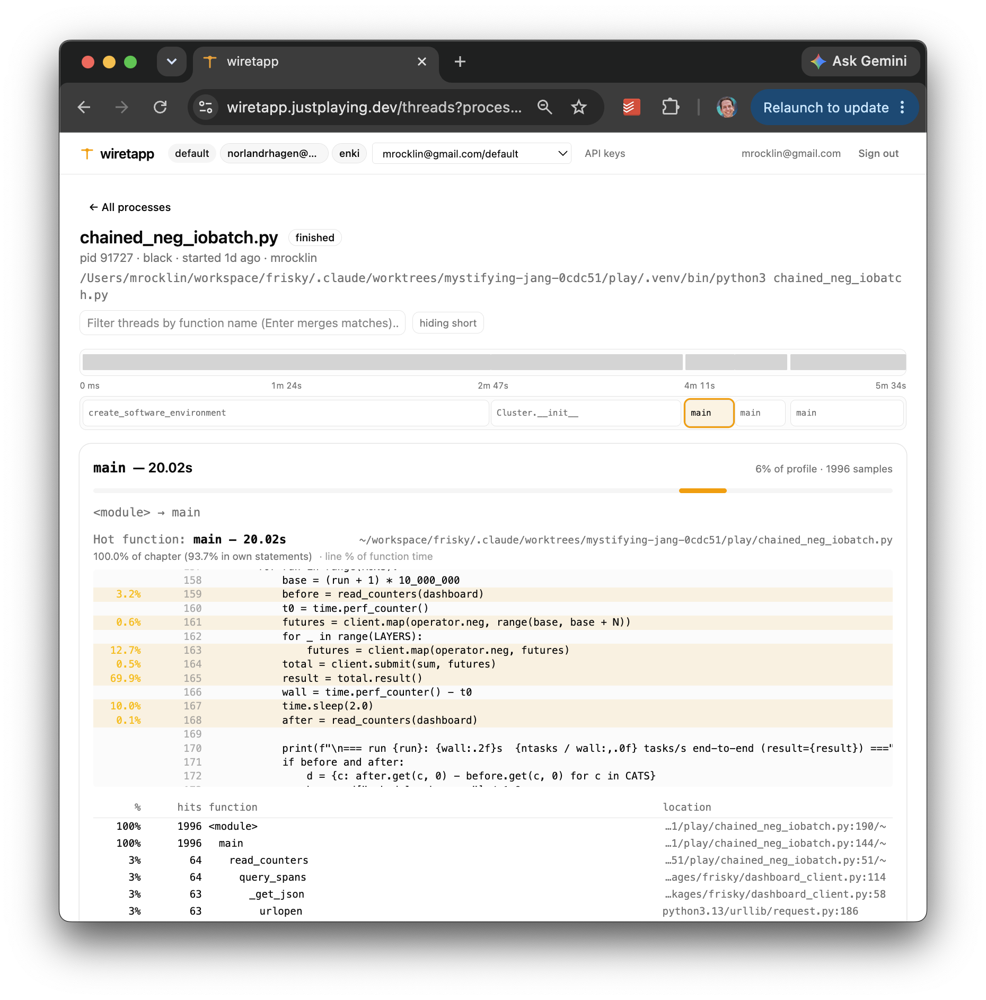

# Updated Thoughts on AI

Six months ago many of us wrote articles about AI.  I certainly did: [AI Zealotry](https://matthewrocklin.com/ai-zealotry/), [We're All Beginners Again](https://matthewrocklin.com/ai-beginners/), [Multi-Agent Workflows](https://matthewrocklin.com/ai-multi-agent/), and [Introducing Claude Chic](https://matthewrocklin.com/introducing-claude-chic/).

It feels like time for an update.  We've all learned a lot since then.

My biggest change in thinking is this:

> The surprising value of AI today isn't super-human depth.  It's super-human breadth.

AI isn't usually better than the best human specialist in one narrow domain.  Good lawyers are better lawyers.  Good accountants are better accountants.  Good engineers are better engineers.

But AI can be a B+ engineer and a B+ lawyer and a B+ accountant at the same time.  That turns out to be extremely useful.  A lot of real work lives between disciplines, and humans are pretty bad at crossing those boundaries quickly.

The second theme of my work recently has been building feedback systems for agents.  Most of my focus on complex projects today is around giving broad context and building systems to deliver good automated feedback so that agents can converge on solid answers on their own.

So my current stance is something like this:

- Give agents broad context
- Give agents fast and thorough feedback
- Stay human enough to notice when the work starts feeling wrong

## What I've been doing

First, some context.  My work lately has included the following:

- **Coiled:** operationally simplifying a VC-funded startup into a small lifestyle company, including devops, legal, accounting, and customer support
- **Dask Scheduler:** rebuilding Dask in Rust
- **Dask Arrays:** building query optimization for Dask arrays
- **Wiretapp:** building a Python profiling SaaS product, mostly for personal use
- **Contract work:** doing some consulting work in quant finance that is super interesting but not easy to talk about

It turns out that [retirement for me](https://matthewrocklin.com/stepping-back/) looks a lot like work, just more interesting and fun.

## AI outside of code

I've been using AI heavily in running a company.  Agents are hooked up not just to my code, but also to:

- **Devops** infrastructure, like logs and Grafana
- **Gmail** and support mailing lists
- **Slack** and customer support channels
- **Our database**, to track customer activity
- **Google Drive**, to access customer contracts and legal forms
- **QuickBooks**, to track customer invoicing
- and soon maybe even our bank

Devops, email, Slack, and database integrations are now pretty common among my peers.  Legal, accounting, contracts, and invoicing seem less common.

Interactions between these systems is where I've seen the most surprising value.
A few examples:

- **QuickBooks + contracts + database:** we found customers we weren't billing but should have, and serious bugs in our billing code.  Coiled makes non-trivially more money now because of this.
- **Documentation + legal:** we updated our MSA to be both more customer friendly and less onerous for us.
- **Source + logs + customer service:** we identify and fix user issues far more quickly.

Mostly, I've been impressed by AI's ability to know several things at once.  This matters more than I expected.

## Breadth beats depth

We usually ask when AI will achieve super-human intelligence and mean, roughly, "when will AI be smarter than the smartest humans on any given topic?"

Pragmatically however, most of the value I'm seeing comes from breadth across topics rather than depth within one topic.  In this respect, AI is already well beyond the capabilities of a single human.

For example:

-   **Updating our MSA:** AI looked at our MSA, our product behavior, and our information security posture in code.  AI proposed a cleaner separation in how we define customer data between data we own and data the customer owns.  The idea was novel, useful, and obvious in retrospect and made both us and our customers more comfortable.

    Our human lawyers missed this because they aren't also engineers.

-   **Collaborating with quants:** I did some consulting setting up computing infrastructure for a small quant finance shop.  I wrote down context on execution.  The quants wrote down how the models worked.  AI was then able to identify modeling errors that were landing in production.

    I missed these errors because I'm not a quant.

    The quants missed these errors because they didn't know how to inspect production.

Human specialists can go deeper than AI, but crossing disciplines requires collaboration, and collaboration among humans is expensive.  Inter-brain communication is hard and rife with conflict.

AI can hold more breadth of expertise in its head, removing the need to communicate.

This has changed how I work.  I don't want narrow AI specialists that focus on one problem.  I try to give agents broad context about the entire effort: product, users, code, people, logs, contracts, billing history, docs, history, current goals, and long-term aspirations.  Context windows today are generous.  We should use them.

## Legal documents

As an aside, I've enjoyed working with AI on legal documents far more than I expected.

This shows up in a few ways:

-   I make legal documents friendlier.

    Many documents are drafted in an aggressive "claim everything unless they push back" style that I find off-putting.

-   When drafting contracts, I'll align with the other party on high-level business points, then feed both parties' points into Claude or Codex with both parties present.  We use AI as a neutral legal compiler.  The document that emerges isn't slanted hard in either direction, and we can iterate on business bullet points rather than trading redlines through lawyers.

-   I engage with legal documents presented to me more often and push back on the nonsense that is typically in there.

The world of legal contracts is worse than it needs to be.  Many lawyers see their role as advocating for and defending their party maximally from risk, even when that risk mitigation harms the business and relationships.  That isn't actually how most parties want to behave, but we feel disempowered because we don't speak legalese.

Now we all have legal translators.  We should use them.  I think more now about our legal infrastructure than I ever used to and I like it.

## Feedback systems

Back in December 2025 I wrote:

> In general we want to give our agents good automated feedback. Tests do this, benchmarks do this, prompting them to assess themselves does this, asking them to explain things to us and have us weigh in on high level topics does this.

> LLMs are smart enough today that if they're given enough of the right feedback they converge to a good solution as-well-or-better-than a senior human engineer (that's my experience at least).

> Our job is to construct a system that gives them the right feedback at the right time, hopefully without our intervention. This is the same job we have when we build human teams; now it's just more impactful to do well.

My belief in this approach has strengthened.  Most of my development cycle now focuses on architecting feedback systems.  In my `AGENTS.md` file identifying and setting up feedback systems is in Phase 1, alongside "make a plan".  It's fundamental to how I work with agents.

I find that agents with good feedback converge reliably while even the smartest of agents without solid feedback can easily go off the rails. I would take a dumb model with good feedback over a smart model without feedback any day.

Let's look at a couple of examples

## Example: Dask in Rust

I'll announce this more seriously soon, but I rebuilt Dask in Rust.  The main feature isn't Rust.  The main feature is that it collects and exposes mountains of telemetry for AI agents, allowing them to self-improve.

For example, here's the output of our `overview` CLI command on a running cluster.  It gives live cluster state, and encourages the agent to drill down to areas of concern.

```text
Overview  http://localhost:8787
  state   workers 6 (0 idle)   waiting 34   processing 1347   memory 7684   erred 0   queued 0
          → stuck? observe blocked

  perf    wall-clock 14.0s   workers 6   tasks 14683   spans 200000
  memory 0.5 GB / 17.2 GB (3% peak)   spilled 0.0 GB   unspilled 0.0 GB   network recv 1.0 GB
          → per-worker memory observe workers   prefix costs observe prefixes http://localhost:8787   in-flight transfers observe transfers

Components
           │0s       2         4         6         8         10        12      14s│     Total
           ├──────────────────────────────────────────────────────────────────────┤
   compute │▇▇██████████████████████████████████▃█████████████████████████████    │   275.6 s
   network │▁▂▂▃▂▄▇▂▂▂▂▂▂▃▂▅▄▂▂▂▂▂▂▂▂▃▂▂▂▂▂▂▂▂▂▂▂██▇██▇▇▇▄▁▁▁▁▁▂▁▁▁▁▁▂▁▁▁▁▂▁▁▁    │    57.9 s
 scheduler │▁▁▁▁▂▂▂▁▁▁▁▁▁▁▁▂▁▁▁▁▁▁▁▁▁▁▁▁▁▁▁▁▁▁▁▁▁▂▂▁▁▁▁▁▁▁▁▁▁▁▁▁▁▁▁▁▁▁▁▁▁▁▁▁▁▁  ▁▁│     3.0 s
     other │▂▂▂▃▄▅▄▂▂▂▂▂▂▂▂▃▂▂▂▂▂▂▂▂▂▂▂▂▂▂▂▂▂▂▂▂▂▃▃▄▃▃▂▃▃▃▂▂▂▂▂▃▃▃▂▃▃▃▂▂▂▃▃▃▂▃▂▂▂▂│    94.7 s
           └──────────────────────────────────────────────────────────────────────┘
→ zoom / full view: observe timeline http://localhost:8787 --view component

Costliest span types — over time
                     │0s        2         4          6         8          10        12   13s│     Total
                     ├──────────────────────────────────────────────────────────────────────┤
worker.exec.call     │▇▇████████████████████████████████████▇█▇▇▇███████████████████████████│   268.6 s
tcp.send.queue       │▁▁▁▁▁▁▂▁▁▁▁▁▁▁▁▁▂▂▁▁▁▁▁▁▁▁▁▁▁▁▁▁▁▁▁▁▁▁▁▇▇▃▃▆▆▅▅▂▁▁▁▁▁▁▁▁▁▁▁▁▁▁▁▁▁▁▁▁▁▁│    17.2 s
tcp.send.write_queue │▁▁▁▁▁▁▂▁▁▁▁▁▁▁▁▁▂▁▁▁▁▁▁▁▁▁▁▁▁▁▁▁▁▁▁▁▁▁▁▄▆▃▃▅▆▄▄▃▁▁▁▁▁▁▁▁▁▁▁▁▁▁▁▁▁▁▁▁▁▁│     8.5 s
tcp.recv.queue       │▁▁▁▁▁▁▁▁▁▁▁▁▁▁▁▁▁▂▁▁▁▁▁▁▁▁▁▁▁▁▁▁▁▁▁▁▁▁▁▆▆▁▃▆▅▄▄▄▁▁▁▁▁▁▁▁▁▁▁▁▁▁▁▁▁▁▁▁▁▁│     8.5 s
tcp.send.compress    │▁▁▁▁▁▂▃▂▁▁▁▁▁▁▁▁▂▁▁▁▁▁▁▁▁▁▁▁▁▁▁▁▁▁▁▁▁▁▂▆▆▄▄▅▄▃▃▂▁▁▁▁▁▁▁▁▁▁▁▁▁▁▁▁▁▁▁▁▁▁│     7.7 s
tcp.send.serialize   │▁▁▁▁▁▁▂▁▁▁▁▁▁▁▁▁▂▁▁▁▁▁▁▁▁▁▁▁▁▁▁▁▁▁▁▁▁▁▁▃▅▃▂▃▄▃▄▂▁▁▁▁▁▁▁▁▁▁▁▁▁▁▁▁▁▁▁▁▁▁│     6.2 s
worker.transfer.recv │▁▁▁▁▁▁▂▁▁▁▁▁▁▁▁▁▂▂▁▁▁▁▁▁▁▁▁▁▁▁▁▁▁▁▁▁▁▁▁▄▄▂▂▄▄▄▅▃▁▁▁▁▁▁▁▁▁▁▁▁▁▁▁▁▁▁▁▁▁▁│     5.5 s
worker.deserialize   │▁▁▁▁▂▂▃▁▁▁▁▁▁▁▁▁▁▁▁▁▁▁▁▁▁▁▁▁▁▁▁▁▁▁▁▁▁▁▁▂▄▅▃▂▃▂▂▂▁▁▁▁▁▁▁▁▁▁▁▁▁▁▁▁▁▁▂▁▁▁│     4.4 s
                     └──────────────────────────────────────────────────────────────────────┘
Memory               │▁▁▁▁▁▁▁▁▁▁▁▁▁▁▁▁▁▁▁▁▁▁▁▁▁▁▁▁▁▁▁▁▁▁▁▁▁▁▁▁▁▁▁▁▁▁▁▁▁▁▁▁▁▁▁▁▁▁▁▁▁▁▁▁▁▁▁▁▁▁│      2% peak
Network              │▁▁▁▁▁▁▁▁▄▄▄▄▄▄▄▃▃▃▃▃▃▃▃▃▃▃▃▃▃▃▅▅▅▅▅▅▅▅▅▅▇▆▆▆▆▆█▇▇▇▇▇▁▁▁▁▁▁▁▁▁▁▁▁▁▁▁▁▁▁│   313.3 MB/s

                Costliest span types
┏━━━━━━━━━━━━━━━━━━━━━━┳━━━━━━━━┳━━━━━━━━━┳━━━━━━━━━┓
┃ Name                 ┃  Total ┃ Per-wkr ┃ Max wkr ┃
┡━━━━━━━━━━━━━━━━━━━━━━╇━━━━━━━━╇━━━━━━━━━╇━━━━━━━━━┩
│ worker.exec.call     │ 268.6s │   44.8s │   45.7s │
│ tcp.send.queue       │  17.2s │    2.9s │    6.0s │
│ tcp.send.write_queue │   8.5s │    1.4s │    3.2s │
│ tcp.recv.queue       │   8.5s │    1.4s │    3.9s │
│ tcp.send.compress    │   7.7s │    1.3s │    2.5s │
│ tcp.send.serialize   │   6.2s │    1.0s │    2.1s │
│ worker.transfer.recv │   5.5s │    0.9s │    1.2s │
│ worker.deserialize   │   4.4s │    0.7s │    1.0s │
└──────────────────────┴────────┴─────────┴─────────┘
Per-wkr = mean over the workers that ran it; Max wkr = the busiest single worker. Max wkr ≫ Per-wkr means a few workers carry the work (imbalance).
→ one op over time: observe timeline http://localhost:8787 --view detailed --prefix worker.exec.call   raw: observe spans http://localhost:8787 --name worker.exec.call

                   Workers unlike their peers
┏━━━━━━━━━━━━━━━━━┳━━━━━━━━┳━━━━━━━━━━━━━━━━━━━━━━━━━━━━━━━━━━━┓
┃ Worker          ┃ Excess ┃ Top deviations (vs median worker) ┃
┡━━━━━━━━━━━━━━━━━╇━━━━━━━━╇━━━━━━━━━━━━━━━━━━━━━━━━━━━━━━━━━━━┩
│ 127.0.0.1:58058 │     3s │ tcp.recv.queue +3s (20σ)          │
│ 127.0.0.1:58053 │     0s │ tcp.send.write +0s (4σ)           │
└─────────────────┴────────┴───────────────────────────────────┘
Each worker's top-3 most unusual span types vs the median worker; Excess = total extra seconds across them.
→ rank all: observe stragglers http://localhost:8787   one worker: observe timeline http://localhost:8787 --worker 127.0.0.1:58058
```

If a run is slow, agents can follow the hints: first to worker costs, then a worker timeline, then raw spans or logs for the specific task.  I no longer try to keep the scheduler state machine in my head all day.  Instead I focus on feeding agents more and better information.  The CLI is like Dask's dashboard, just in text for LLMs.

My job stopped being to understand the system in detail, but rather to build systems so that it can understand and improve itself.

## Example: Wiretapp, a Python profiler

In my work I'm often asked to look at a Python workflow and figure out why it's slow.  To help with this I made [Wiretapp](http://wiretapp.justplaying.dev), a pyspy-like sampling profiler that aggregates nearby traces into cohesive regions of execution. (definitely not ready for public use)

In my code I run this:

```python
import wiretapp
wiretapp.start()
```

And I get live output on a webpage like this:



Similarly agents can query all of this with a CLI.

The goal is that a typical program has neither one monolithic profile nor 1,000,000 traces.  Instead it has maybe 10 to 100 profiles for cohesive regions throughout the program.

My system-level `AGENTS.md` knows about Wiretapp.  If an agent is curious about a program, it can add Wiretapp and get a second-by-second view of what happened.  We no longer need to add logging and timing code into every little script.  The feedback is automatic, and it is stored for future comparison.

Again, this is the point: agents get better when the environment talks back.

## Staying human

In my original post I wrote something like this:

> Early in using Claude Code, my job was to enable AI, rather than the other way around. This was **frustrating and dehumanizing**.

This remains a struggle.

As we remove dehumanizing work, we accelerate our productivity until we're again bottlenecked by dehumanizing behavior at a new scale.  Remaining mindful about how we think alongside agents is perhaps the most important part of this discipline.

Many of the annoying interactions from six months ago have been solved:

- Giving permission: auto-permission systems in Claude and Codex
- "Are you done yet?": hooks that play a chime when finished
- Parsing output: nicer UX in desktop apps
- Managing many terminals: multi-agent managers in desktop apps
- Asking new agents for review: again, desktop apps can handle this

Today I mostly struggle with feeling attached to the computer while I wait for things to finish.

This manifests in two ways:

-   **Problem:** I stare at my screen waiting for one of many sessions to finish.

    **Solution:** Go on a walk with a phone and remote control active, so I can drive the session while outside.  Codex's phone experience is especially good.

    **Solution:** Just go on a walk.

-   **Problem:** I want to pack my laptop up and head out the door, but don't want to shut down my laptop and disturb running agents.

    **Solution:** I rent a $10/month box on Hetzner and do long-running development there.

Productivity is seductive.  I haven't figured out yet if my goal is to remain productive while still feeling unburdened, or if my goal is to train myself out of wanting to feel productive.

## Tools and context

I use both Claude and Codex.  The best comparison I've found is the following:

> Claude is like a junior engineer with too much coffee.  It jumps right to the task, gets it done, and causes some minor havoc along the way that needs to be cleaned up in another pass.

> Codex is like a senior engineer with not enough coffee.  Thoughtful, doesn't make a mess, but sometimes needs to be goaded into action.

*(from somewhere on reddit I can no longer find)*

I tend to ask Codex for work that is more open-ended and Claude for work that is better scoped.

I've also been experimenting with local models like `qwen3` through the `pi` harness.  I like it.  They are faster, less capable, and more interactive.  That combination makes me think more and be more active in the work.  I use local agents when I want to learn about a topic rather than delegate a chunk of work entirely.

On context:

- I don't use skill files.
- I invest heavily in project-level `AGENTS.md` files.
- When I build tools like Wiretapp or Dask-in-Rust, I put a lot of context into CLI help strings, far more than I would for humans.

The practice that matters most to me is periodically refreshing project-level `AGENTS.md` files.  I never have agents write them.  I update them myself every few days when working actively.

## Summary

My stance today is that agents should have broad context and strong feedback systems and that humans need to improve on stepping back and thinking.
