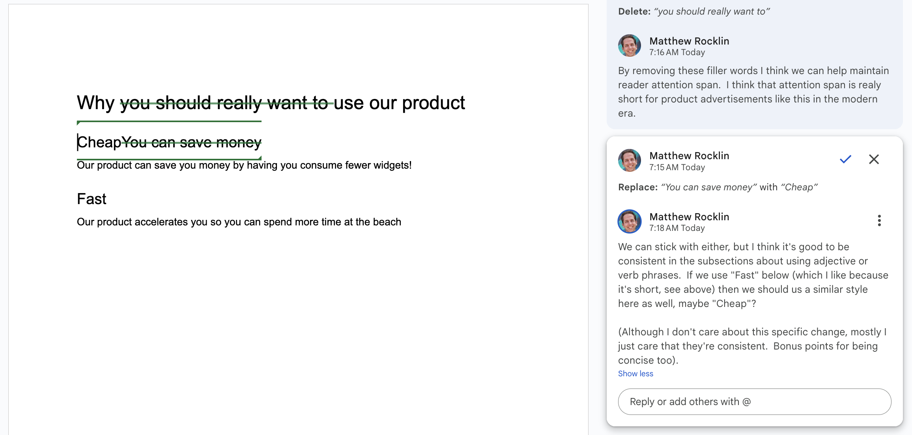

How GitHub taught me to Micromanage
===================================

Feedback is critical to performing good work as a team.
Good feedback cultivates quality work and professional growth.
Bad feedback degrades quality and erodes relationships.

This article explains my experience of feedback in open source community code
review, and the culture that emerged from intense detailed feedback.  Then we
shift to corporate settings and see and how these lessons fail to apply
cleanly.


Open Source Code Reviews
------------------------

I first experienced transformative feedback when working in old-school open
source communities.  These weren't corporate environments.  These were a bunch
of volunteers working together to build something awesome used by rest of the
world.  There were no managers, no performance reviews, no video meetings, no
meetings at all in fact.  There was just the work, and the work was the focus of all
communication.

The work took three forms:

1.  **Issues:** where we discussed concerns and considered technical designs as a group
2.  **Coding:** where one person would write a solution to the proposed issue
3.  **Code Review:** where anyone could drop in, review the code, and provide feedback.

Most of the work was in *Code Review*, not *Coding* (writing code is a
vanishingly small fraction software development) and so I spent several hours
every day, for years, giving and receiving highly detailed feedback from fellow
collaborators.  This is where we taught each other.  This is where we learned
to align on mission and style.  This is where we expressed humor and learned
about each others' character and about our own.

Let's see an example

Example
-------

In this example we see some simple proposed code below, and then consider
bad/ok/good feedback on that code.

**Proposed code**

```python
x = 0
for element in data:
    x = x + f(element)
```

**Bad Review**

*Please don't use for loops.  They're hard to understand.  Also please use
informative variable names.*

**OK Review**

*Please don't use for loops.  They're hard to understand.  Also, please use
informative variable names.*

*How about the following?*

```python
total = sum([f(record) for record in housing_records])
```

**Good Review**

*I suggest that we avoid explicit for loops here.  I think that a list
comprehension would be a better fit.*

*This is a bit subjective, I find that list comprehensions make it more clear
to the reader what's going on at a glance because they're a more constrained
construct.  (The same could be said for using `map`, but I rarely see that
pattern in this codebase).*

*How about this?*

```python
total = sum([f(record) for record in housing_records])
```

*Now, this practice can definitely get out of hand (I've seen some crazy nested
list comprehensions) so there's a tradeoff between using common explicit
technologies like for loops (easy to reason about, but you have to read them)
and using patterns like list comprehensions (tricky when large, but immediately
recognizable if simple). I think that for simple cases like this the tradeoff
is strongly in favor of the list comprehension.*

*Anecdotally, this is also the norm in this codebase.*

### Analysis

Let's assess each piece of feedback and why I personally think that they're
bad/ok/good.

-  **Bad feedback** critiques code, but doesn't offer a better direction.

    Critique without constructive direction is just complaining,
    and adds constraint to the author without also helping with momentum.

-  **OK feedback** provides direction.

    The reviewer works with the author to produce a better result.

-  **Good feedback** educates the author.

    The reviewer works with the author to produce a better result.

    The reviewer works to also improve the author, an investment in their joint future.

The good feedback is thorough, especially given how trivial the code is, and
especially given that the new solution and the old solution *do the same exact
thing*.  It's not like there was some important bug here.

The main reason for good feedback is to invest in the author.


Role of Code Review
-------------------

We see then that code reviews serve a few different roles:

1.  Ensure quality work
2.  Teach fellow developers
3.  Align on conventions and process

Personally, this is how I learned to write code.  This community and practice
is the reason for my success in career, which has transformed my life.  I am
grateful.  This community and practice is also the primary way for me to give
back to fellow devs around the world.  I can see the impact I and others have
had daily in the lives and success of colleagues that I've known for decades.


OSS Idiosyncrasies
------------------

After thinking about this life experience and comparing it to corporate work
(which I'll get to next), I think that there are some interesting idiosyncrasies
about this practice and people that are worth mentioning:

1.  **Craftsmanship:** These people care deeply about their craft
2.  **Volunteerism:** Everyone is a volunteer, spending their personal time on this activity
3.  **Work Focus:** All feedback and conversation is focused on the work,
    rather than on the person
4.  **Public:** All feedback is fully public
5.  **Respect:** Respect is assumed broadly (we rarely volunteer with people
    that we don't enjoy)


Corporate contexts
------------------

*Why the heck is the CEO correcting my grammar!?*

This same approach of highly detailed and thoughtful review does not transfer
well to corporate contexts in my experience.  As an example, let's consider the
following exchange over a google doc:



When I first transitioned from OSS dev to CEO at a startup I did *lots* of review
like this.  What I found were questions/concerns/problems like the following
(all of which are valid in hindsight)

1.  Why is the CEO correcting my grammar?
2.  If you want these changes, why not just edit the doc directly?
3.  This doc isn't high priority. Why do you want to talk about this so much?
4.  Why do you keep telling me how bad I am at writing?

These questions confused me.  I realized that it was because that the implicit
message received behind my feedback was very different.

Implicit messages
-----------------

There was a major difference in the implicit message that is being received in
the first open source case than in the second corporate case.

-  **Open Source:** *I believe in you and your work.  I see potential for you to
   get even better at your craft and would be proud to invest my time to see that happen.*

-  **Corporate:** You're doing a bad job.  I'm going to explain, in minute
   detail, exactly what you did wrong, over and over again because I hate you
   and want you to suffer.

What before was a supportive behavior is now an abusive one.
Everything depends on context.

*Note: to be clear, this miscommunication isn't the receiever's fault.  We as
reviewers need to better model our context so we can anticipate how
feedback will be received.*


Corporate Mindset
-----------------

This negative reception feels more reasonable when you consider the mindset and
context in which this work is done.  Referring back to the OSS Mindset above,
let's compare with corporate.

-  **Honing a craft:** in old-school community OSS people cared *a lot* about
   getting better at development.  Micro-adjustments to our form were really
   valuable to us.  Development skill was a big part of our (or at least my) self-identity.

   Conversely in corporate few people care as deeply about the craft of
   writing, meeting facilitation, graphic design, etc..  Skillbuilding is nice,
   but it's secondary to getting work done.  The assumption is that feedback is
   primarily focused on the job at hand, rather than on building our teammates.

-   **Assumed Respect:** in volunteer OSS if people don't like you they just ignore you.
    Anyone reviewing your work is doing so because they care and want to help
    you.

    This doesn't hold in a corporate environment, where people are paid to help
    whether or not they like you.

This does beg the question though, what would a corporate environment look like
where people cared deeply about things like meeting facilitation and slide
design?  Probably the company would go quickly out of business, but it's a fun
thought to consider, and maybe apply a little bit of in our everyday life.


Feedback Reception Budget
-------------------------

And so, I've learned that a person can absorb only about one piece of feedback
per interaction, and then only if it's labeled very specifically as feedback
with the best intentions, and wrapped delicately in a feedback sandwich.

Because of this volume constraint, infrequent feedback must be more general and
higher level, ideally accompanied by impersonal assets like a blogpost that the
recipient of the feedback can read separately (this is partially why I write
blogposts).


But please ...
--------------

For the love of god ...

-  Remove filler words like "really", "very" or anything else that doesn't change
   the meaning of a sentence
-  Do not start meetings by asking everyone to introduce themselves
-  Attach agendas to meetings ahead of time
-  When making slides think about text contrast and use alignment guide-lines

Thanks for listening, hopefully this article ...

1.  Helps people around me understand the implicit message behind my feedback
2.  Gives everyone desiring a spirit of craftsmanship more interest in
    developing a strong culture of constant constructive feedback
