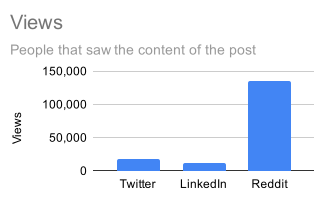

Reddit, Twitter, and LinkedIn Comparison
========================================

Historically I mostly used Twitter to broadcast my work.
However, Twitter today is less effective than it once was.
What's the best alternative?

I recently published work on big data benchmarks and pushed out the same
message on all of the following platforms.

-  [Twitter](https://twitter.com/mrocklin/status/1721879714871316512)
-  [LinkedIn](https://www.linkedin.com/posts/mrocklin_spark-dask-duckdb-polars-tpc-h-benchmarks-activity-7127650276966113280-4DTf?utm_source=share&utm_medium=member_desktop)
-  [Mastodon](https://fosstodon.org/@mrocklin/111369552234850135)
-  Reddit (all of
   [r/dataengineering](https://www.reddit.com/r/dataengineering/comments/17puedp/spark_dask_duckdb_polars_tpch_benchmarks_at_scale/),
   [r/datascience](https://www.reddit.com/r/datascience/comments/17qm6ob/spark_dask_duckdb_polars_tpch_benchmarks_at_scale/), and
   [r/python](https://www.reddit.com/r/Python/comments/17pwxfn/spark_dask_duckdb_polars_tpch_benchmarks_at_scale/))

This post quantifies the views and engagement I received on each.

Results
-------

I care both that people see my initial message, and that they engage with it by
actually watching the attached video/viewing the attached blogpost.

| Source     | Views      | Upvotes      | Comments       | Click Through  |
| ---------- | ---------- | ------------ | -------------- | -------------- |
| Reddit     |    135,100 |  248         |    51          |    528         |
| Twitter    |     18,600 |  169         |     4          |    461         |
| LinkedIn   |     11,355 |  112         |    12          |    471         |

Summary
-------

A couple takeaways:

1.  Reddit gets *way* more readership and engagement than Twitter or LinkedIn.
2.  Twitter and LinkedIn push readers to external links more effectively.
3.  It's actually pretty easy to just publish on all of them

That's it!  Thanks for reading.  Below I include the message I published.  It
went out as a general post on Reddit and LinkedIn, and as a stream of
posts/replies on Twitter and Mastodon.

The Message
-----------

I pushed out this text on all three platforms.  On Twitter / Mastodon it was as
a stream.  On Reddit / LinkedIn it was a single post.

### Spark, Dask, DuckDB, Polars: TPC-H Benchmarks at Scale

I gave this talk at PyData NYC last week. It was fun working with devs from various projects (Dask, Arrow, Polars, Spark) in the week leading up to the event. Thought I'd share a re-recording of it here

[youtu.be/wKH0-zs2g_U](https://youtu.be/wKH0-zs2g_U)

This is the result of a couple weeks of work comparing large data frameworks on benchmarks ranging in size 10GB to 10TB. No project wins. It's really interesting analyzing results though.

DuckDB and Dask are the only projects that reliably finish things (although possibly Dask's success here has to do with me knowing Dask better than the others). DuckDB is way faster at small scale (along with Polars). Dask and Spark are generally more robust and performant at large scale, mostly because they're able to parallelize S3 access. Really-good-S3 access seems to be the way you win at real-world cloud performance.

Looking more deeply at Dask results, we're wildly inefficient. There's at least a 2x-5x performance increase to be had here. Given that Dask does about as well as any other project on cloud this really means that *no one* has optimized cloud well yet.

This talk also goes into how we attempted to address bias (super hard to do in benchmarks). We had active collaborations with Polars and Spark people (made Polars quite a bit faster during this process actually). See [https://matthewrocklin.com/biased-benchmarks.html](http://matthewrocklin.com/biased-benchmarks.html) for more thoughts.

This also shows the improvement Dask made in the last six months. Dask used to suck at benchmarks. Now it doesn't win, but reliably places among the top. This is due to ...

1. Arrow strings
2. New shuffling algorithms
3. Query optimization

There's a lot of work for projects like Dask and Polars to fix themselves up in this space. They're both moving pretty fast right now. I'm curious to see how they progress in the next few months.

For future work I'd like to expand this out a bit beyond TPC-H. TPC-H is great because they're fairly serious queries (lots of tables, lots of joins) and not micro-benchmarks. We could use broader coverage though. Any ideas?
