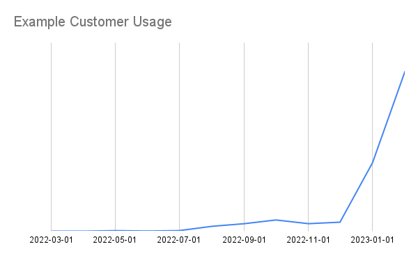

SaaS Go-to-Market
=================

Where are we on product and GTM?  What are some open questions and what should
we do to improve?

This article gives a snapshot of where Coiled (Dask company) is on product
development and sales and marketing / Go-to-Market (GTM).  It's mostly written
with internal audience in mind, but should also be helpful for other early
stage tech/SaaS companies as an example.

Summary
-------

Our product is now good enough that when people try it, they like it,
eventually use more, and pay us real amounts of money.  🎉

But we don't have many of these customers.  😔

How do we get more? 🤔

How did we get into this situation?  What should we do from here?

History
-------

For the first couple years of the company, the product kinda sucked.  That's
ok!  We were still a baby company learning how to walk.  At the time we also
had a mature sales organization that did its best to sell this kinda-sucky
product.  This was inefficient and frustrating for all involved.

In May of last year we let go of the sales team, and a couple months later we
let go of the the folks in marketing who owned voice/messaging (this wasn't
particularly strong either).  We became very engineering-forward as a company.
The platform team became staffed only by very senior engineers who had full
agency.

This was great!  Our product evolved quickly, our Twitter account stopped
sounding spammy, and our website started to make sense!

What's more, platform users started to use us more, and became happier.  Usage
ticked up a couple months later and really started to take off recently as we
spread within organizations.

Whereas previously we were unbalanced with a bad product and good sales, now we
have a good product and relatively little sales experience in the company.
What should we do?  Try to go back to our previous state?  Maybe / maybe not.
Let's explore our options.

Customer Profile
----------------

The kind of GTM engine we build depends on the market that we're going after.
This affects how we market ourselves, how we price the product, and what kind
of sales team we build:

What choices do we have?  Mostly we break down this choice by company/team size:

1.  **Individuals:** we target individual data professionals to use our platform,
    kinda like Github does

    -   **Marketing:** highly technical online content, maybe some events, focusing
        on ease of use and accelerating work
    -   **Pricing:** mostly free with a possibility of swiping a credit card for up
        to a few hundred dollars a month (typically the budget for individual
        data professionals)
    -   **Sales:** no sales team, must be self-serve (we can't hand-hold
        individuals, and sales teams will want commissions)

2.  **Small teams:** we serve small teams of data professionals, talking mostly
    to the team lead, who cares mostly about getting work done, but also has to
    justify costs

    -   **Marketing:** a mix of highly technical content with some business value
        thrown in as well
    -   **Pricing:** free tier is useful for trials, but we expect to charge a few
        thousand a month, either with a corporate card or with a purchase order
        (typically the budget for a team lead without getting higher approval)
    -   **Sales:** maybe rely on a self-serve motion to get people in the door,
        and then try to sell them to pre-commit to greater usage with
        discounted rates.  This requires a lightweight sales team attached to
        a product that can sell itself.

3.  **Enterprise:** we target entire companies, probably talking to some IT
    architect, or a CTO.  They care about accelerating the company, and also
    about costs, security, and generally not causing a panic.

    -   **Marketing:** focus on business value with a simpler technical message.
        Some online content but direct outreach.
    -   **Pricing:** $100,000-$1,000,000s, probably after a POC and with some
        healthy support contract thrown in
    -   **Sales:** this is a high contact sales process that takes many months.
        This requires a sizable and expensive team working full time on chasing
        down new deals and working those deals to completion.

As a company we could play at any of these levels.  Dask has great community
adoption and could leverage those users into a strong individual userbase (like
GitHub).  Alternatively, we're also heavily used inside of large organizations
(banks, government, healthcare, etc.) that are used to paying millions of
dollars for a product like ours, and so an Enterprise play could also make
sense.

Which market we go after affects our choices about sales and marketing.  What
do we choose?

Most of the money is in large enterprise sales.  It's hard to find a company in
our space (data infrastructure) bringing in hundreds of millions of dollars
where most of that money doesn't come from large enterprise contracts.  We have
a few of these already, mostly focused around [Dask
support](https://www.coiled.io/blog/enterprise-dask-support), and we like them.

However, selling into these companies has a long lead time, long iteration
cycles, and poor visibility/learning due to stringent security.  For this
reason, we've focused on the less lucrative, but more informative individual
and small teams groups.  This allows us to focus on a cloud SaaS product, which
gives us a lot of visibility into usage, which we leverage to accelerate
product velocity.

Our thesis is that by starting with small teams we can more rapidly iterate
towards a delightful experience, which we can then pivot to larger enterprise
for real money.  Will that work?  🤷 I think so?

What team is best?
------------------

Given this focus on individuals and small teams, what kind of GTM team do we
need?  Our previous sales team had SDRs, account executives, sales engineers,
customer support, customer success managers, and more.  This team made lots of
sense for a large enterprise sales motion, but it may not make as much sense
for individuals (no sense) and small teams (maybe some sense).

### What did we like about our old team?

-   **Outreach:** They reached out directly to potential customers

    Our marketing at the time was not good (it's still not good).  Lots of
    people said "Of course we love Dask, but who's Coiled?".  The sales team,
    through direct outreach, was able to shore us up a bit here.

    This feels like a bandaid though.  Our marketing should be doing outreach for us.

-   **Explanation:** They explained our product to customers

    Same as above, we didn't describe ourselves well, and so prospects had a
    bunch of questions like "do you deploy in my cloud", "are you secure",
    "how does this compare to Databricks?", and "how much will this cost me?"
    which our sales representatives were able to answer and bring people in.

-   **Onboarding:** They helped customers onboard to the platform

    The platform had issues, and the sales engineers were able to set things up
    for the customers so that they could onboard and actually use the product.

    This is mostly handled today with the product (it's much better) or with
    light touches from the engineering team itself.  I think that it's good for
    the engineers to have this direct access.  I don't think that I would want
    to change this today.

-   **Customer Success:** They helped customers use the platform to solve business problems

    Once the platform is running well for the customer, and they start really
    banging away with Dask, they eventually run into some problem with Dask or
    the PyData system generally.

    We don't have a good answer for this today, and could become better.  Our
    OSS Dask engineers are asking for more customer exposure, and this could be
    a good fit, as long as we figure out how to make it informative rather than
    distracting, which is hard.

-   **Tracking:** They were organized about all of the prospects and customers and who needed
    what to move along

    There are lots of people using this platform, and we're not mature enough
    where everyone gets to their ideal state (using us as much as possible as
    efficiently as possible) without help (really, no product is this mature).
    The sales team was somewhat organized here.

    We don't have a good solution for this today.

-   **Closing:** They navigated organizations to find buyers

    When an individual without purchasing power arrives, the sales team was
    good at saying "Do you have the ability to buy our product?  No?  Who does?
    Can I ask you to set up an introduction?" and then once the sale was
    complete they helped to hound the customer's internal bureaucracy to make
    sure that money flowed through.

    This is less important for small team sales than for enterprise customers,
    but there is still non-trivial value.  Today I / our director of finance
    does this.  It's been ok but not great.

### Focus on Marketing

A lot of the tasks above should have been automated (outreach, explanation,
onboarding), but they weren't.  We used people/conversations as a replacement
for technology/writing.

Mostly, we lacked a strong product marketing function and made up for it with a
lot of hands-on outreach and explaining.  I'm entirely in-favor of doing
hands-on work to learn, but we didn't then translate those learnings into
long-term assets that help *everyone* understand the value that we provide
without having to tell them one-by-one.

Because of this experience, this time around I'd like to focus on on product
marketing, this includes assets like ...

-   Architecture diagrams / videos
-   Build vs buy comparisons in a few common situations (individual, small
    team, larger more active team) and how we're always the better choice
-   Our Security model and FAQ about data privacy
-   Common use cases

Even if we were to hire out a sales leader for more outreach/tracking/closing
I'd want to have these things first.  Otherwise I think our newly hired sales
leader would be be spinning their wheels (and those are very expensive wheels).

Question: self-serve or direct sales?
-------------------------------------

I like the idea of self-serve.  The story goes like this, a user ...:

-   Learns about our product
-   Uses our product for free and loves it
-   Uses it enough to start paying money and can do that easily in the product
    with a credit card
-   Uses it even more, to the extent where they need to get authorization and
    have an actual conversation

Examples of this motion include GitHub, AWS, and Atlassian.  It's great because
you can focus on building an amazing user experience, rather than focusing all
of your energy and money on sales.

In principle this sounds great!  It speaks to my inner-engineer and
community-oriented mindset.  However, almost no company in our space makes most
of their money this way.  Most companies do direct outreach and sell a complete
package to companies from the start.  The self-serve nature of the product ends
up being useful for companies to quickly do proof-of-concept (POC) work, and
for students, but that's it.

Self-serve feels right, but imprudent.  This is still an open question for me.

Question: Straight to Enterprise?
---------------------------------

Big companies use Dask.  We're not like other early stage tech companies that
are trying to get their name out there.  We regularly turn away big companies
with lots of cash looking for a self-managed Dask management platform.  Maybe
we should stop turning them away, and instead lean into this?

This goes against the common wisdom of the day which says "go cloud", "go
broad", and "go managed" which, from a learning and velocity perspective, I
like.  But it does with the timeless wisdom of "go where the money is".

I intend to stay with Cloud SaaS, which kind of precludes Enterprise until we
get a lot more mature / trusted.  However we'll experiment with deploying our
platform in a self-managed way in a couple of friendly customers to see what
the experience is like.  This is an experiment and a distraction from focus,
but I think a good one if we can do it well with the right partners.

Who to hire?
------------

Right now three of us in the company think broadly about the entire GTM strategy:

-  me
-  product owner / engineering manager
-  finance director

It's good for the three of us to have this exposure (it informs how we do our
normal jobs) but we're all also pretty busy, and so are doing a suboptimal job
of the GTM work.

I think I want to hire a single high performing individual who can flex between
product marketing and some salesmanship, as well as be organized and creative.
Over time, once they're successful, they'll hire a team around them.

How do we find such a wonderful person?  Classic sales roles are typically not
sufficiently technical for a product like ours, and they tend to be a bit more
mechanical.  Classic marketers tend to be creative, but lack the technical
and sales experience.  Maybe a product marketing manager or a product manager?
Our ideal GTM role doesn't fit into any traditional job description.  Probably
I'm looking for someone who has done a couple of these jobs, and is used to
[early stage thinking](think.md).

Right now I'm talking to lots of people.  Do you know of someone like this?
Please put us in touch!

Edit: Update
------------

Currently we're hypothesizing that we want a single strong performer who is
comfortable doing the following activities starting out:

1.  **Social**: Talk to lots of prospects, understand their pain and questions
2.  **Technically Conversant**: need to be able to speak the language and
    empathize with our current highly technical users
2.  **Good Writer**: Ensure that we have good answers, and that we have good broadcast materials to answer those questions
3.  **Creative and Hungry**: Try out a bunch of hacky experiments
4.  **Organized**: Follow up with prospects
5.  **Motivated**: Close relatively small deals (we've found that this is pretty easy once
    they're using the product, which has a generous free tier)

Once this works they'll then need to hire people to do more of this, and
empower them appropriately.  This usually means that they're years but not
decades into their career.

We're guessing that this comes from one of a couple possible profiles:

1.  **Extrovert engineer**: comes from a background sales/field engineering,
    customer success, or product management.  They used to be highly technical,
    but are now as curious about building a sales and marketing motion as about
    core technology.
2.  **Technical Inside Sales Leader**: they started out in inside sales for a
    related highly technical product (like Databricks).  They succeeded by
    understanding and caring about their product.

We want someone who is conversant in our space (ramp up time is too long here).
They don't need to be a hardcore distributed systems engineer, but should, for
example, be comfortable talking about the relative merits of various file
storage solutions (parquet, deltalake, snowflake) and knock beers together
while griping about Kubernetes / cloud deployment pain (even if they don't have
hands on experience there).

If you know or are such a person then please get in touch.
